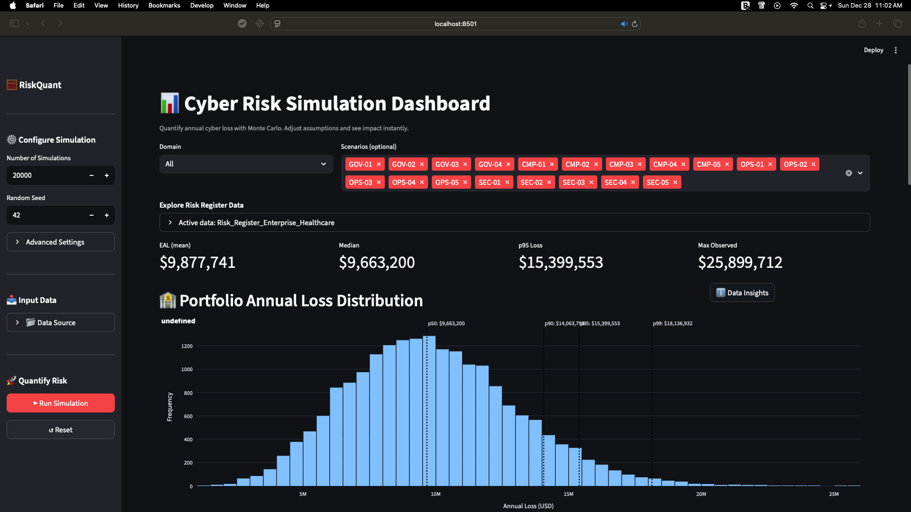
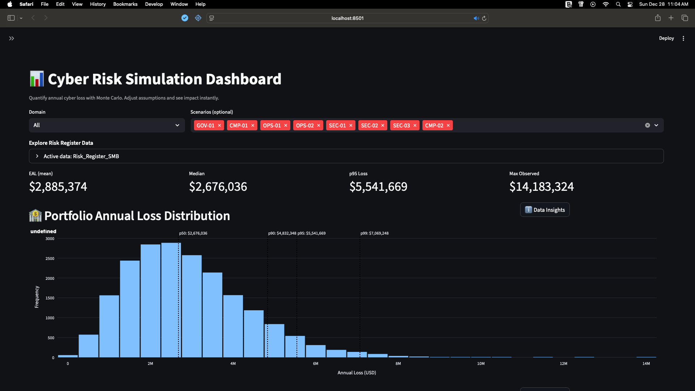
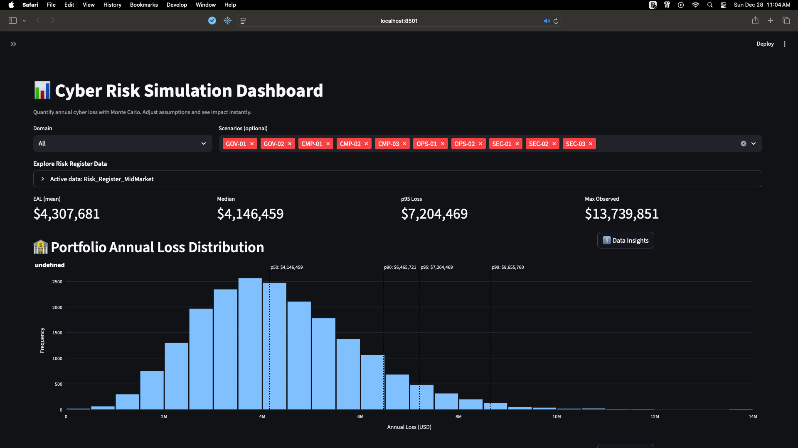
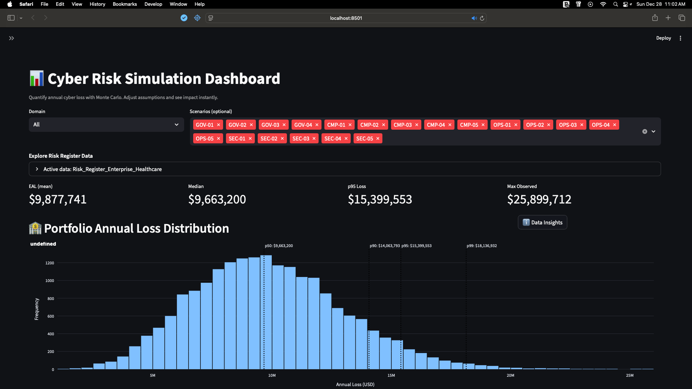
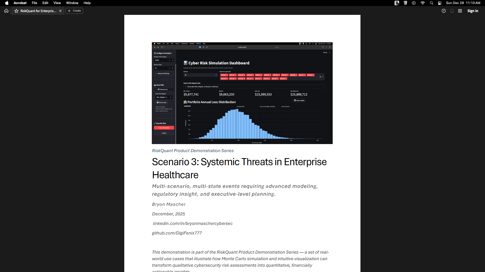

# RiskQuant — Monte Carlo Cyber Risk Quantification Dashboard

RiskQuant is a **quantitative cyber risk demonstration platform** that uses Monte Carlo simulation to model potential financial loss from cybersecurity incidents.

It is designed to help organizations and decision-makers understand cyber risk in **probabilistic and financial terms**, rather than relying solely on qualitative risk ratings.

This repository serves as both:
- A **technical portfolio project** demonstrating applied risk modeling and secure software design
- A **set of realistic product demonstrations** tailored to different organizational sizes and maturity levels

---


*RiskQuant dashboard configured for the Enterprise Healthcare demonstration scenario.*

## What RiskQuant demonstrates

RiskQuant illustrates how organizations can:

- Quantify cyber risk using **loss distributions** rather than single estimates
- Interpret **percentiles** (p50, p90, p95) for decision support
- Compare risk across domains such as Governance, Compliance, and Security
- Perform **scenario-level and portfolio-level analysis**
- Communicate cyber risk in a way that supports executive and board discussions

The platform emphasizes **transparency, defensibility, and education**, not prediction.

---

## Demonstration scenarios

RiskQuant includes three fully documented demonstration scenarios, each calibrated to a different organizational context:

---

### Small & Medium Business (SMB)

- Focus: Phishing and credential compromise
- Audience: Business owners, IT managers, non-specialist stakeholders
- Emphasis: Financial impact awareness and visualization interpretation

📄 [SMB Demo](docs/demos/SMB/README.md)

---

### Mid-Market

- Focus: Vendor supply-chain compromise and SaaS platform failure
- Audience: IT managers, security generalists, GRC practitioners
- Emphasis: Domain comparison, prioritization, and budgeting

📄 [Mid-Market Demo](docs/demos/Mid-Market/README.md)
### Enterprise Healthcare

---


- Focus: Portfolio cyber risk in regulated healthcare environments
- Audience: Security leadership, compliance teams, auditors, executives
- Emphasis: Portfolio synthesis, regulatory exposure, and tail-risk analysis

📄 [Enterprise Healthcare Demo](docs/demos/Enterprise-Healthcare/README.md)

---

📁 Full documentation and demo artifacts are available under:  
[Documentation](docs/README.md)

---

## Documentation and supporting materials



The `docs/` directory contains:

- **Demo walkthroughs** (PDFs with Executive Summaries and Tables of Contents)
- **Companion visual guides** with annotated screenshots
- **Visual risk registers** used as simulation inputs
- A **technical white paper** explaining the modeling framework
- A centralized explanation of **data sources and modeling assumptions**

📄 Start here:  
[Documentation](docs/README.md)

---

## Modeling approach (high level)

RiskQuant uses Monte Carlo simulation to model uncertainty in cyber risk.

At a high level:
- Event frequency is modeled probabilistically
- Loss severity is modeled using bounded distributions
- Thousands of simulations generate a loss distribution
- Results are interpreted using percentiles rather than averages

This approach allows decision-makers to reason about **ranges of outcomes**, including low-probability, high-impact events.

A deeper technical explanation is provided in the white paper.

---

## Data sources and assumptions

Scenario assumptions are informed by **publicly available industry research and regulatory guidance**, including breach reports, cost studies, and enforcement history.

Sources are explicitly cited within each demo and the white paper using standard white-paper notation (e.g., `[1]`, `[2]`).

A centralized explanation of how these sources are used is available here:

📄 [Data Sources and Assumptions](docs/methodology/Data_Sources_and_Assumptions.md)

---

## Codebase overview

The RiskQuant application is implemented in Python and organized under:

📁 `src/montecarlo_app`


Key components include:
- Risk register ingestion and normalization
- Scenario-level and portfolio-level simulation
- Interactive Streamlit dashboard
- Visualization of loss distributions and risk comparisons

Risk registers used in the demos are provided in:

📁 `data/input`


---

## Intended use

All materials in this repository are provided for **educational and demonstration purposes**.

RiskQuant is intended to:
- Illustrate approaches to cyber risk quantification
- Support discussion and learning
- Demonstrate applied cybersecurity, GRC, and risk analysis skills

It does **not** predict specific events, losses, or regulatory outcomes.

---

## About this project

RiskQuant was developed as a **cybersecurity portfolio project** to demonstrate applied skills in:

- Governance, Risk, and Compliance (GRC)
- Quantitative risk analysis
- Secure software design
- Data modeling and visualization
- Technical communication for varied audiences

The project integrates realistic scenarios, defensible assumptions, and professional-grade documentation to reflect how cyber risk analysis is performed in practice.

---

## Getting started

To run the dashboard locally:

```bash
pip install -r requirements.txt
streamlit run src/montecarlo_app/dashboard/app.py
```
Then select a demo risk register from the sidebar and explore the simulation outputs.

---

## License

This project is released under the MIT License.

---
## Navigation

Proceed to the main project and demos:

📄 [Documentation Home](../README.md)

Jump directly to the demo scenarios:

📄 [SMB Demo](../demos/SMB/README.md)

📄 [Mid-Market Demo](../demos/Mid-Market/README.md)

📄 [Enterprise Healthcare Demo](../demos/Enterprise-Healthcare/README.md)
